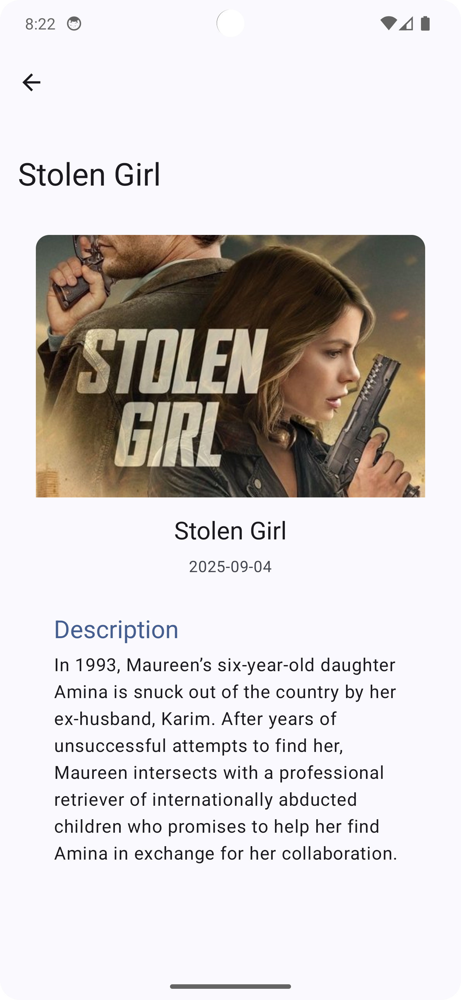

# 🎬 Movie-App (Jetpack Compose) — Watchmode API Assignment


A **Movie & TV Show discovery Android app** built with **Jetpack Compose** that demonstrates fetching and displaying content from the **Watchmode API**.  
This project satisfies assignment requirements: **simultaneous API calls using RxKotlin `Single.zip`**, **MVVM architecture**, **Dependency Injection (Koin)**, **Retrofit networking**, **shimmer loading states**, **graceful error handling**, and a **details screen**.

---
<p align="center">
  
  
  
</p>

## 📑 Contents
- [About](#about)
- [Features (mapped to assignment requirements)](#features-mapped-to-assignment-requirements)
- [Architecture & Tech Stack](#architecture--tech-stack)
- [Project Structure](#project-structure)
- [Getting Started](#getting-started--setup--configuration)
- [Build & Run](#build--run)
- [Testing & Quality](#testing--quality)
- [Assumptions & Known Issues](#assumptions--known-issues)
- [Future Improvements](#future-improvements)
- [Contributing](#contributing)
- [License](#license)
- [Contact](#contact)

---

## 🧩 About

This app provides a simple, practical Movie & TV Show discovery experience:

- Home screen lists **movies and TV shows** (switchable via tabs/toggle).
- Tap any item to view **details** (title, description, release date, poster).
- **Shimmer placeholders** show while data loads.
- **Simultaneous API calls** using RxKotlin `Single.zip` to fetch movies and TV shows concurrently.

---

## 🎯 Features (mapped to assignment requirements)

### 1. Home Screen
- Fetches and displays movies and TV shows from the Watchmode API.
- Top **tabs/toggle** to switch between Movies and TV Shows.
- **Shimmer effect** for loading state.


---

### 2. Details Screen
- Displays **title, description, release date**, and **poster image**.
- Shimmer placeholders while details or images load.
---

### 3. API Integration
- **Retrofit** used for networking.
- **Two API calls executed simultaneously** using RxKotlin `Single.zip`, results merged in ViewModel.
- Models map API responses to UI-friendly data.

---

### 4. Error Handling
- Network/unexpected errors shown via **Snackbar (Compose Scaffold)** or **Toast** with retry action.

---

### 5. Architecture & Patterns
- **MVVM architecture**: ViewModel → Repository → DataSource.
- **Dependency Injection**: Koin.
- **Reactive handling**: RxKotlin (`Single.zip`) + coroutines (where appropriate).
- **Image loading**: Coil.
- **Shimmer effect**: Accompanist Placeholder or custom shimmer.

---

## 🏗 Architecture & Tech Stack

| Layer | Technology |
|-------|-------------|
| Language | Kotlin |
| UI | Jetpack Compose |
| Networking | Retrofit + OkHttp |
| Reactive | RxJava / RxKotlin (`Single.zip`) |
| Dependency Injection | Koin |
| Image Loading | Coil (Compose) |
| Shimmer | Accompanist Placeholder |
| Unit Testing | JUnit, Mockito / MockK |
| Build System | Gradle (Kotlin DSL) |

---

## 📁 Project Structure

app/
├── src/main/java/.../
│ ├── ui/ → Compose screens & components
│ ├── viewmodel/ → ViewModels
│ ├── data/ → Repository, models, network layer
│ ├── di/ → Koin modules
├── src/test/ → Unit tests
└── build.gradle

---

## 🚀 Getting Started — Setup & Configuration

### Prerequisites
- Android Studio (latest stable version)
- JDK 11+
- Gradle wrapper included
- A valid **Watchmode API key** (register at [https://api.watchmode.com/](https://api.watchmode.com/))

---

### Configuration — Watchmode API Key

#### Option A: `local.properties` (Recommended)
1. Open or create `local.properties` in project root.
2. Add your API key:
   ```properties
   WATCHMODE_API_KEY="your_watchmode_api_key_here"
```
In app/build.gradle, ensure your API key is exposed as a BuildConfig field:

```groovy
def watchmodeApiKey = project.hasProperty("WATCHMODE_API_KEY") ? project.WATCHMODE_API_KEY : ""
buildTypes.each {
    it.buildConfigField "String", "WATCHMODE_API_KEY", "\"${watchmodeApiKey}\""
}
```
## 🧱 Build & Run
1. Clone the Repository
```bash
git clone https://github.com/pawan1-tech/Movie-App.git
```
2. Open in Android Studio
   Open the project directory in Android Studio.

3. Add your Watchmode API key (see above)
4. Run the App
   Select a device/emulator → Run ▶️

### Build Release APK
```bash
./gradlew assembleRelease
```
Output:
`app/build/outputs/apk/release/app-release.apk`

### Run Unit Tests
```bash
./gradlew test
```
## 🧠 Implementation Notes
Simultaneous Calls: Two Watchmode endpoints fetched concurrently using RxKotlin Single.zip.

Error Handling: Repository & ViewModel manage error states and emit UI-safe results.

Shimmer: Skeleton placeholders for loading states.

DI: Koin modules provide Retrofit, Repository, and ViewModel instances.

Images: Coil handles async image loading with placeholder/error states.

## ✅ Testing & Quality
| Area | Tool |
|---|---|
| Unit Tests | JUnit, Mockito / MockK |
| Architecture Validation | MVVM |
| Reactive Calls | RxKotlin Single.zip |
| UI Framework | Jetpack Compose |

## ⚠️ Assumptions & Known Issues
- Requires a valid Watchmode API key.

- Watchmode rate limits may throttle frequent requests.

- Some API fields may change — defensive model mapping used.

- Offline caching and pagination not yet implemented.

## 🌱 Future Improvements
- Integrate Paging 3 for larger datasets.

- Add offline caching (Room/SQLDelight).

- Implement Compose UI tests.

- Improve animations and transitions.

## 🤝 Contributing
- Contributions are welcome!

- Open an issue or submit a pull request.

- Follow Kotlin and Jetpack Compose best practices.

## 📜 License
This project is licensed under the MIT License — see below for details.


## 📬 Contact
Maintainer: @pawan1-tech
For issues, feedback, or sharing APK/video links, please open a GitHub issue or contact via the repository.

---
